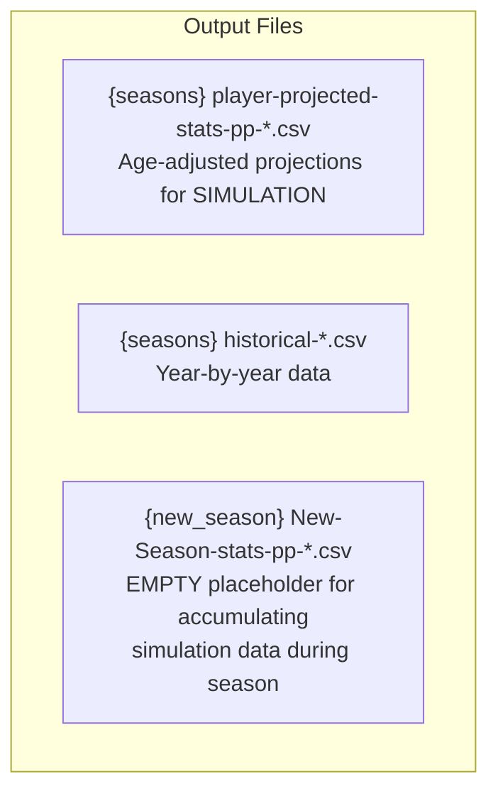
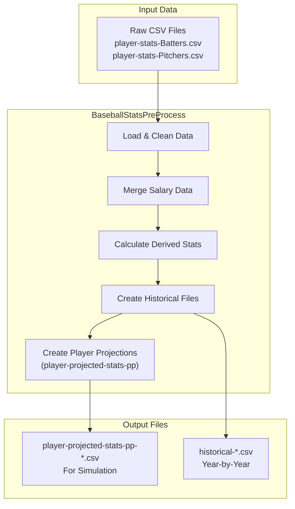
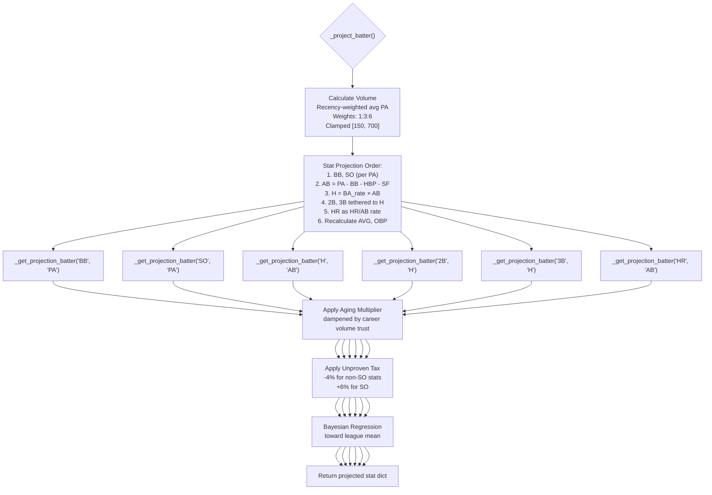
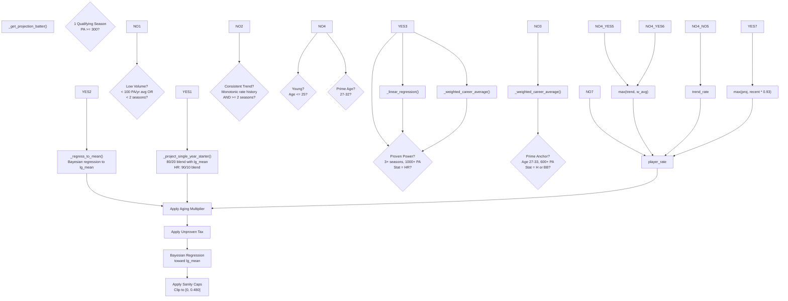
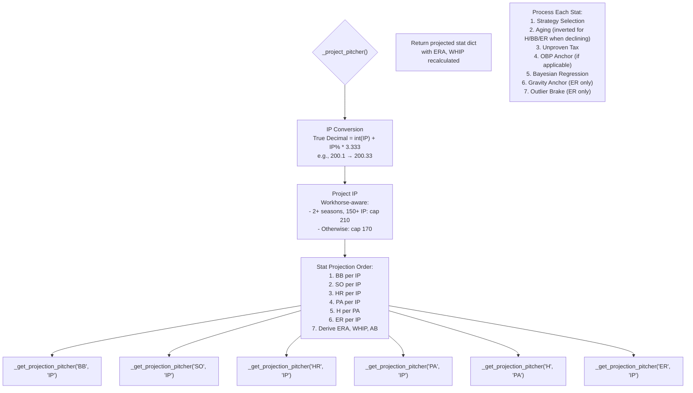
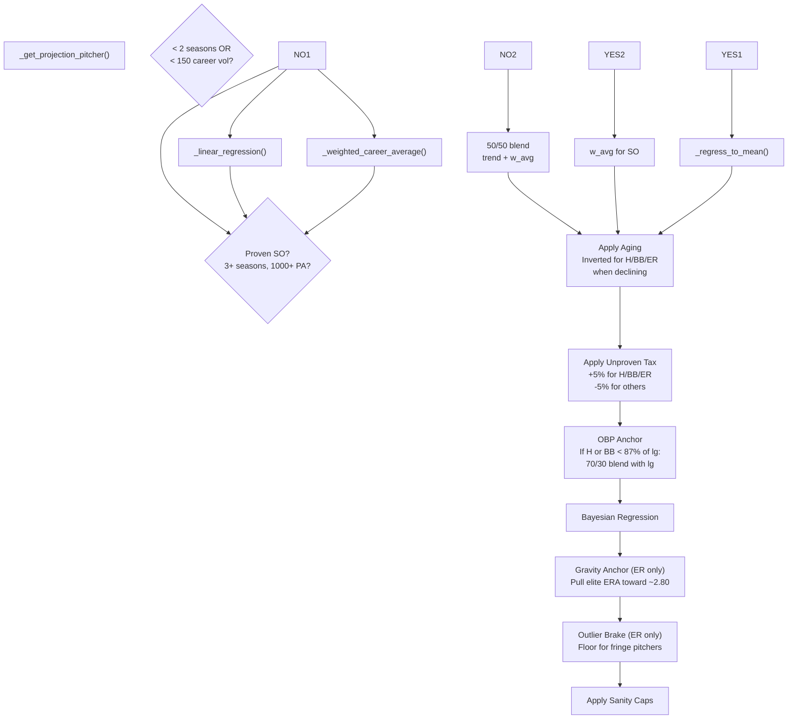
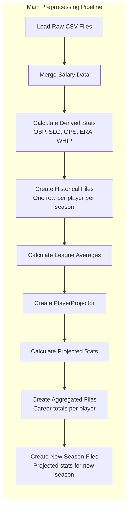
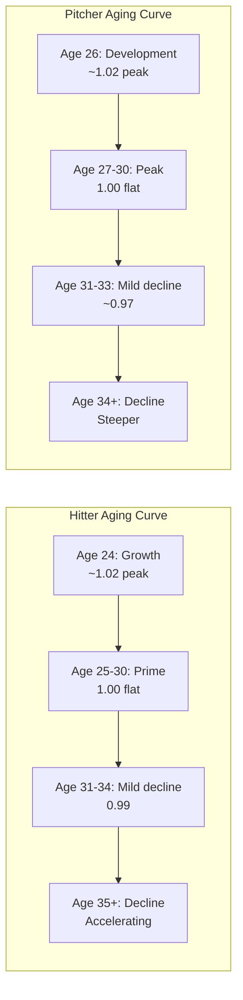

# Baseball Statistics Preprocessing: Projection Flow

This document describes the data flow and projection logic for both batters and pitchers in the baseball simulation preprocessing pipeline.

## Output Files



### File Descriptions

| File | Purpose | Used By |
|------|---------|---------|
| `player-projected-stats-pp-*.csv` | **Age-adjusted projections** for game simulation | Simulation engine |
| `historical-*.csv` | Year-by-year data for analysis | Projections, UI |
| `New-Season-stats-pp-*.csv` | **Empty placeholder** - accumulates sim data | Admin UI save |

**Note:** The `player-projected-stats-pp` files contain the projected stats for simulation. The `New-Season-stats-pp` files are empty placeholders that get populated during the simulation with real-time stats.

## Preprocessing Pipeline



## Key Concepts

### 1. Bayesian Shrinkage
Low-sample players are regressed toward a computed league mean using K-values. Higher K = stronger pull toward league average.

```
final_rate = (player_rate * career_vol + K * lg_rate) / (career_vol + K)
```

### 2. Aging Curve
A parabolic multiplier is applied based on projected age:
- **Batters**: Peak ~27, flat prime 25-30, decline after 34
- **Pitchers**: Peak ~28, flat prime 27-30, steeper decline after 34

### 3. K-Values by Stat

| Stat | Batter K | Pitcher K | Purpose |
|------|----------|-----------|---------|
| H | 40 | 2500 | BABIP regression |
| BB | 50 | 300 | Plate discipline |
| SO | 100 | 100 | Strikeout rate |
| HR | 25 | - | Power stability |
| 2B | 80 | - | Doubles respect |
| 3B | 200 | - | High variance |
| ER | - | 300 | ERA anchoring |
| Default | 150 | 250 | Fallback |

---

## Batter Projection Flow



### Batter Strategy Selection (`_get_projection_batter`)



**Legend:**
- `YES1`, `NO1` = Yes/No branches from CHECK1
- `YES2`, `NO2` = Yes/No branches from CHECK2
- `YES3`, `NO3` = Yes/No branches from CHECK3
- `NO4_YES5` = CHECK4 = No, then CHECK5 = Yes
- `NO4_YES6` = CHECK4 = No, then CHECK6 = Yes
- `NO4_NO5` = CHECK4 = No, then CHECK5 = No
- `YES7`, `NO7` = Yes/No branches from CHECK7

---

## Pitcher Projection Flow



### Pitcher Strategy Selection (`_get_projection_pitcher`)



---

## Full Pipeline Flow



---

## Aging Curve Visualization



---

## Stat Dependency Order

### Batters (Must be in this order for consistency)

1. **PA** - Base volume (weighted average)
2. **BB, SO** - Anchored per PA
3. **AB** - Derived: PA - BB - HBP - SF
4. **H** - As BA rate × AB (prevents 7-point AVG leak)
5. **2B, 3B** - Tethered to H as ratios (e.g., HR/H)
6. **HR** - Projected as HR/AB (not HR/H)
7. **AVG, OBP** - Recalculated from final counts

### Pitchers (Must be in this order)

1. **IP** - Base volume (workhorse-aware)
2. **BB, SO, HR** - Per IP
3. **PA** - Per IP (for consistency)
4. **H** - Per PA (more stable than per IP)
5. **ER** - Per IP with gravity anchor
6. **ERA, WHIP** - Recalculated from counts

---

## Key Fixes Applied

| Issue | Solution |
|-------|----------|
| 7-point AVG leak | Project H as BA × AB, not independent |
| HR under-projection | Project HR directly as HR/AB, not HR/H |
| Logan Webb IP math | Convert to true decimal before calculations |
| Slap hitter power | ISO identity gate caps HR/H at 4% |
| Elite ERA outliers | Gravity anchor pulls toward ~2.80 ERA |
| Unproven players | Tax adjustment for players < 500 PA |
| V-shaped injury years | Detection + smoothing available |

---

## Files Involved

| File | Purpose |
|------|---------|
| `bbplayer_projections.py` | Main preprocessing orchestrator |
| `bbplayer_projections_forecast_player.py` | Projection engine with strategies |
| `bbstats.py` | Runtime stats management |
| `at_bat.py` | At-bat simulation using projected stats |

## Running Preprocessing

```bash
# Create projected stats files for simulation
venv_bb314.2/Scripts/python.exe bbplayer_projections.py

# With specific seasons
# Edit load_seasons in bbplayer_projections.py

# Files created:
# {seasons} player-projected-stats-pp-Batting.csv    <- Age-adjusted projections for SIMULATION
# {seasons} player-projected-stats-pp-Pitching.csv   <- Age-adjusted projections for SIMULATION
# {seasons} historical-Batting.csv                   <- Year-by-year data
# {seasons} historical-Pitching.csv                 <- Year-by-year data
# {new_season} New-Season-stats-pp-Batting.csv      <- EMPTY placeholder for accumulating sim data
# {new_season} New-Season-stats-pp-Pitching.csv    <- EMPTY placeholder for accumulating sim data
```
