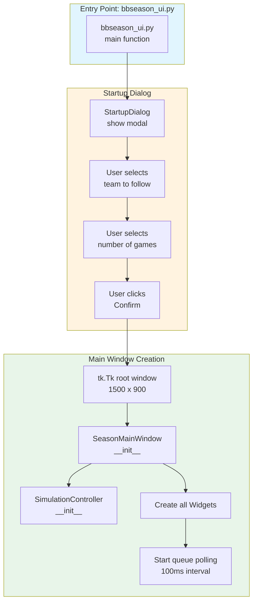
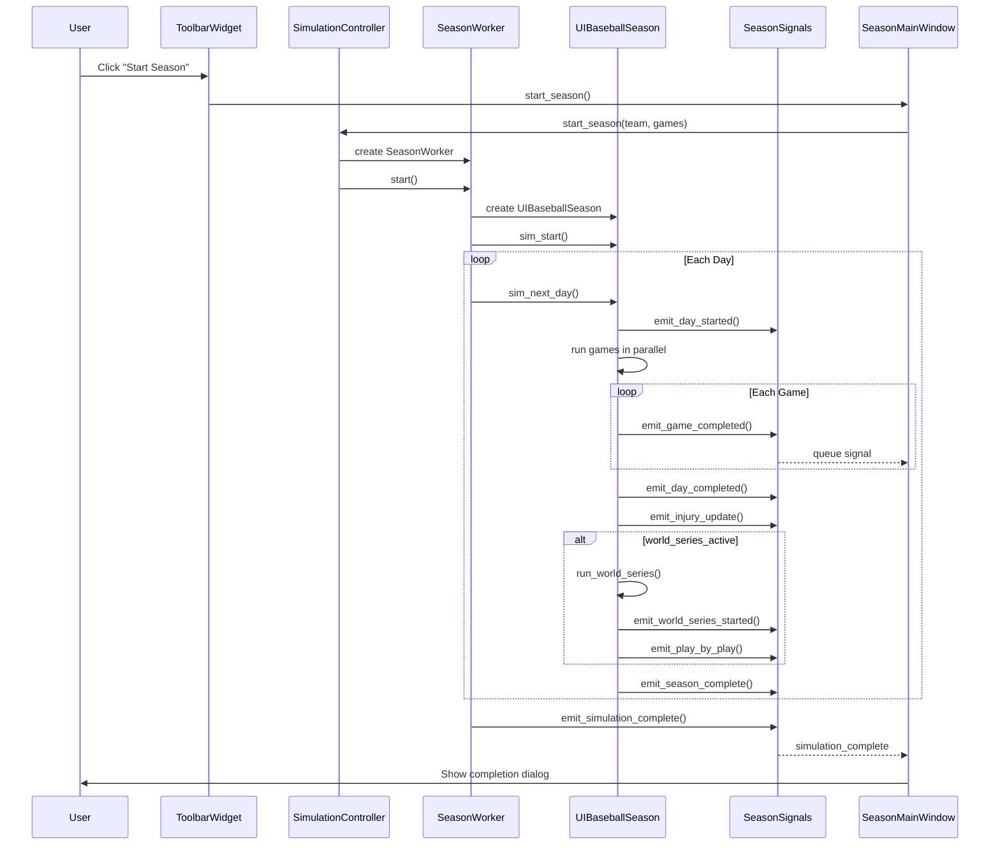
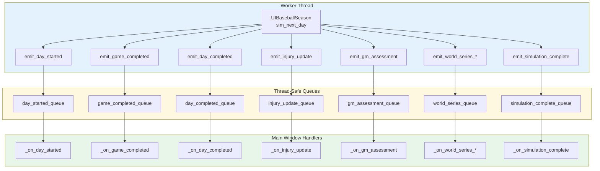
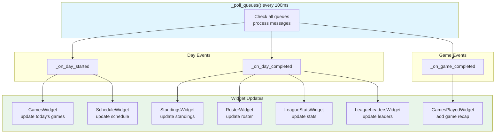
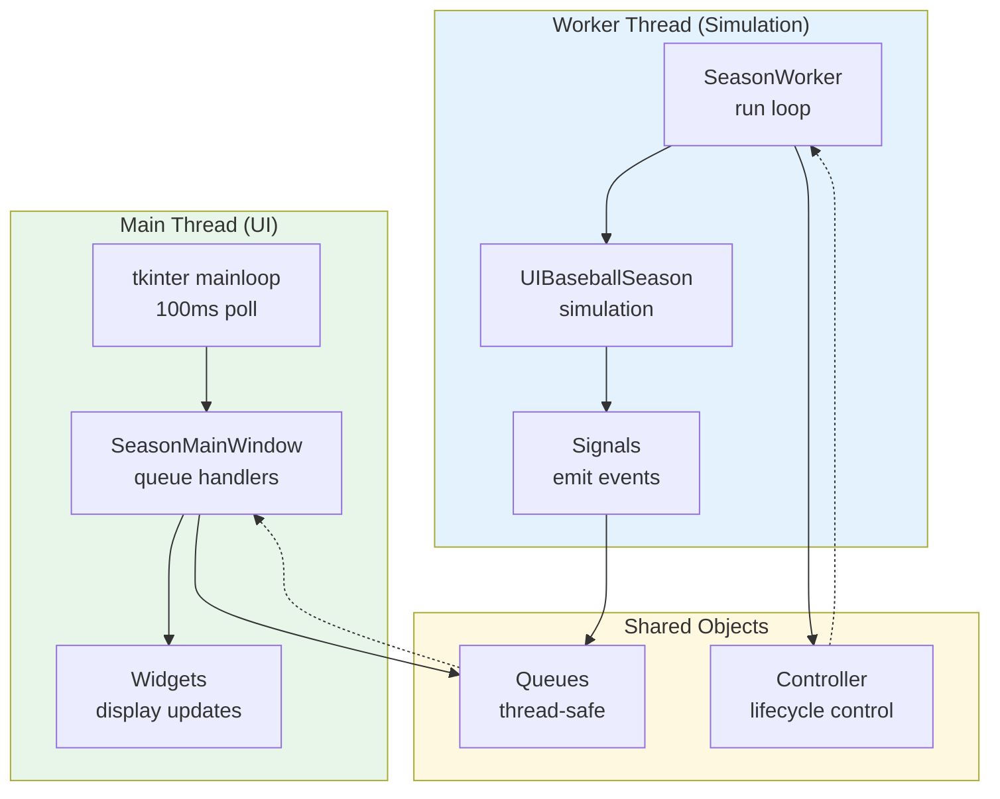
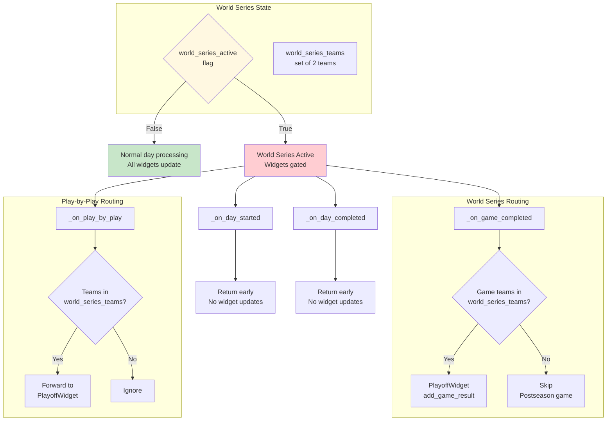

# UI Flow Documentation

This document provides visual flowcharts of the baseball simulator UI architecture.

## Table of Contents
1. [Application Startup](#application-startup)
2. [Main Window Layout](#main-window-layout)
3. [Simulation Flow](#simulation-flow)
4. [Queue Communication](#queue-communication)
5. [Widget Update Flow](#widget-update-flow)
6. [Thread Architecture](#thread-architecture)
7. [Season Progression](#season-progression)

---

## Application Startup



---

## Main Window Layout

```mermaid
flowchart TB
    subgraph ROOT["tk.Tk Root Window"]
        TB[ToolbarWidget<br/>Play | Pause | Next Day<br/>Team Dropdown | OBP Adj]
        SB[Status Bar<br/>Day # | Progress | Status]
        PWS[PanedWindow<br/>expand=True]
    end

    subgraph PANES["PanedWindow Panes"]
        LEFT[StandingsWidget<br/>AL | NL<br/>300px min]
        RIGHT[Notebook<br/>Tabs]
    end

    subgraph TABS["Notebook Tabs"]
        T1["Today's Games"<br/>GamesWidget]
        T2["Schedule"<br/>ScheduleWidget]
        T3["League"<br/>Leaders | Stats | IL | Admin]
        T4["{Team}"<br/>Roster | Games | GM Assessment]
        T5["Playoffs"<br/>PlayoffWidget]
    end

    subgraph LEAGUE_SUBS["League Sub-Tabs"]
        L1[LeagueLeadersWidget]
        L2[LeagueStatsWidget]
        L3[InjuriesWidget]
        L4[AdminWidget]
    end

    subgraph TEAM_SUBS["Team Sub-Tabs"]
        TE1[RosterWidget]
        TE2[GamesPlayedWidget]
        TE3[GMAssessmentWidget]
    end

    ROOT --> TB
    ROOT --> SB
    ROOT --> PWS
    PWS --> LEFT
    PWS --> RIGHT
    RIGHT --> T1
    RIGHT --> T2
    RIGHT --> T3
    RIGHT --> T4
    RIGHT --> T5
    T3 -.-> LEAGUE_SUBS
    T4 -.-> TEAM_SUBS
    LEAGUE_SUBS -.-> L1
    LEAGUE_SUBS -.-> L2
    LEAGUE_SUBS -.-> L3
    LEAGUE_SUBS -.-> L4
    TEAM_SUBS -.-> TE1
    TEAM_SUBS -.-> TE2
    TEAM_SUBS -.-> TE3

    style ROOT fill:#fce4ec
    style TABS fill:#e8eaf6
    style PANES fill:#f3e5f5
```

---

## Simulation Flow



---

## Queue Communication



---

## Widget Update Flow



---

## Thread Architecture



---

## Season Progression

```mermaid
flowchart TB
    START[Start Season]
    
    subgraph PRE_GAME["Pre-Game Setup"]
        S1[Create UIBaseballSeason]
        S2[Load teams & players]
        S3[Generate schedule]
        S4[sim_start]
    end

    START --> PRE_GAME

    loop For Each Day
        D1[emit_day_started]
        D2[Simulate all games<br/>parallel threads]
        D3[emit_game_completed<br/>for each game]
        D4[emit_day_completed<br/>all games done]
        D5[emit_injury_update]
        D6[Check GM assessments]
        D7[Update standings]
        
        D1 --> D2 --> D3 --> D4 --> D5 --> D6 --> D7
        
        alt world_series_active
            WS1[Run World Series]
            WS2[emit_world_series_started]
            WS3[emit_play_by_play]
            WS4[emit_world_series_completed]
            D7 --> WS1 --> WS2 --> WS3 --> WS4
        end
    end

    D7 --> CHECK{Days =<br/>Total Games?}
    CHECK -->|Yes| END[emit_simulation_complete]
    CHECK -->|No| loop

    style START fill:#e8f5e9
    style PRE_GAME fill:#e3f2fd
    style END fill:#c8e6c9
```

---

## World Series Gating



---

## Key Files Reference

| File | Purpose |
|------|---------|
| `bbseason_ui.py` | Entry point, StartupDialog |
| `ui/main_window_tk.py` | SeasonMainWindow, layout, queue polling |
| `ui/season_worker.py` | Background thread, pause/resume control |
| `ui/signals.py` | Thread-safe queue communication |
| `ui/controllers/simulation_controller.py` | Worker lifecycle management |
| `ui/ui_baseball_season.py` | UIBaseballSeason, signal emission |
| `ui/widgets/*.py` | Individual UI components |

## Running the UI

```bash
# Full UI with tkinter
venv_bb314.2/Scripts/python.exe ui/main_window_tk.py

# With free-threaded Python for parallel games
uv run -- python -X gil=0 ui/main_window_tk.py
```
